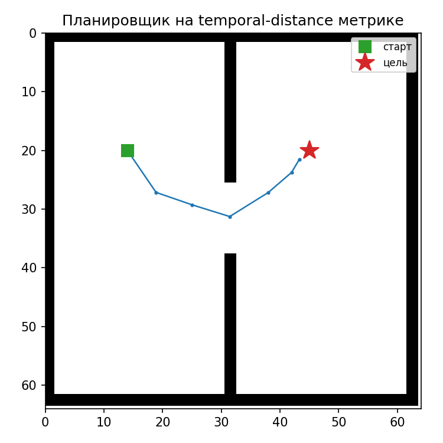
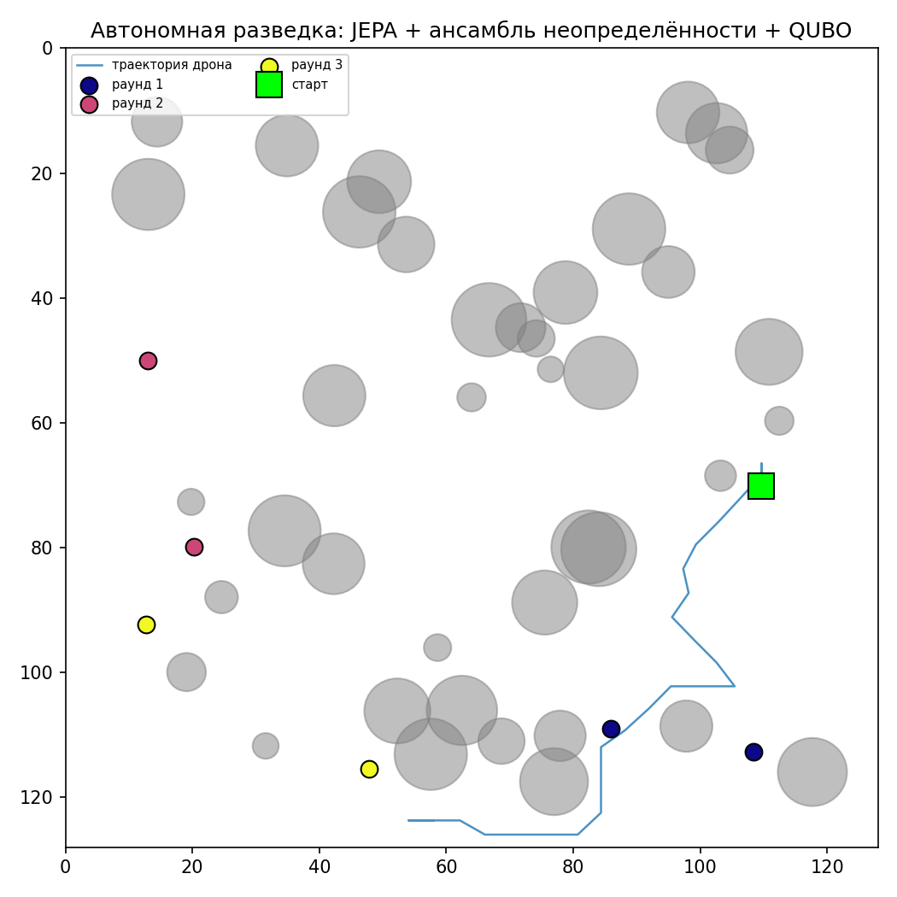

# JEPA World Models: from a two-room toy to hierarchy, uncertainty, and drone navigation

Self-supervised world models built from scratch, following the JEPA
(Joint-Embedding Predictive Architecture) line of work. Started as a toy
project on a single GPU; grew into a controlled empirical study of when
hierarchical abstraction actually works, plus an applied track exploring
autonomous drone exploration.

**No pixel reconstruction anywhere in this repo.** Every model predicts
*representations*, not images. The one decoder that exists (`core/`) is a
diagnostic probe on a frozen encoder, never part of training.

## Repository structure

```
core/            base JEPA: encoder + predictor, planning, uncertainty ensemble
hierarchy/       MAIN RESULT — when does hierarchical abstraction actually help?
drone_quantum/   applied track — QUBO frontier selection, closed-loop exploration
docs/            architecture diagrams, write-ups, reports
assets/          result images referenced below
```

Each subfolder has its own README with exact run commands and result numbers.
`hierarchy/` and `drone_quantum/` each duplicate the small set of `core/`
modules they depend on (`env.py`, `models.py`, `losses.py`,
`train_distance.py`, etc.) so that every folder is runnable standalone —
`cd` into any one of them and go, no path hacks or package install needed.

## The main result: hierarchy is not free

**[→ hierarchy/README.md](hierarchy/README.md)**

H-JEPA (LeCun, 2022) proposes multi-scale predictive abstraction as an
architectural blueprint, without a concrete training recipe or a way to
verify the top level learned something real rather than decorative. This
project builds exactly that verification, with a random-baseline control at
every step:

| Condition | Trained top level vs. random control |
|---|---|
| Full observability, recurrent | **decorative** — gap $0.83\pm0.17$pp over 3 seeds (nothing to add) |
| Partial observability, instantaneous | **decorative** — 0.340 vs 0.358, trained slightly *below* random (no mechanism) |
| Partial observability, recurrent | **real** — gap $19.91\pm3.36$pp over 3 seeds |
| Open world, landmark density sweep | **no monotonic law survives multi-seed replication** (see hierarchy/README.md — a promising single-run trend did not hold up) |

Conclusion: hierarchy only helps when two conditions hold *simultaneously* —
a mechanism to accumulate history, and information genuinely missing without
it. This is essentially why DreamerV3's RSSM is built the way it is, arrived
at here through controlled experiment rather than by reading the diagram.

## Core JEPA: representation, planning, uncertainty

**[→ core/README.md](core/README.md)**

- Linear probe R² = 0.999 on agent position from a 128-d latent.
- Naive L2 distance in latent space is a bad planning metric (correlation
  with true reachability: 0.67) — a learned temporal-distance metric fixes
  it (correlation: 0.86), letting the agent plan through a doorway it can't
  see directly.
- A 5-member predictor ensemble gives calibrated uncertainty
  (disagreement/error correlation ≈0.98 over multi-step rollouts).



## Applied track: drones and quantum optimization

**[→ drone_quantum/README.md](drone_quantum/README.md)**

Frontier selection for autonomous exploration formulated as QUBO (solved via
simulated annealing, architecturally ready for real quantum annealing
hardware): avoids redundant nearby candidate points that a greedy selector
would pick, at negligible cost to information value (0 redundant pairs vs.
3.1 on average across 10 seeds, for a 2.6% loss in total uncertainty
covered). Wired into a closed-loop exploration demo: encoder → ensemble →
QUBO → latent-space navigation.



### Observation design determines whether latent planning works

A second study moves to an **underactuated 2.5D quadrotor** (thrust + tilt;
horizontal motion exists only as a consequence of tilting) and asks whether
a purely visual world model can plan to a goal given as an image. A control
run — the same CEM planner on *true physics* — reaches the goal 10/10,
isolating planner correctness from model quality. Five observation designs
were then measured:

| Configuration | probe x | probe θ | probe vx | planning |
|---|---|---|---|---|
| Egocentric crop | 0.53 | 0.92 | 0.16 | 0/10 |
| Global view, per-episode maps | −0.94 | −0.34 | −0.06 | 0/10 |
| Global view, fixed map | 0.99 | 0.34 | 0.06 | 1/10 |
| Dual-channel (global + ego) | 0.98 | 0.94 | 0.28 | 2/10 |
| Dual-channel + recurrent context | 0.99 | 0.95 | **0.77** | **5/10** |
| *CEM on true physics (control)* | — | — | — | *10/10* |

Each row closes one measured information deficit and control improves
monotonically. Row 2 is a clean case of **shortcut learning**: prediction
loss *decreased* while probe R² went negative, because between-episode map
variance was 5.1× the within-episode drone motion and the map is static
within an episode — so encoding the background minimises loss. Row 5
replicates the `hierarchy/` finding on a physically distinct system: a
matched-dimensionality random *instantaneous* projection gives exactly
0.000 gain, while recurrence lifts velocity estimates threefold.

## Honest limitations

- All toy environments are small (64×64 or 128×128 pixel grids); nothing
  here has touched real sensor data.
- The hierarchy landmark-density sweep needed multiple seeds to separate
  signal from training-noise — see `hierarchy/README.md` for the
  methodological detail, since an earlier 3-point version of that result
  looked cleaner than it actually was.
- The closed-loop drone demo is an engineering integration, not a
  controlled experiment — treat its 80% waypoint success rate as a
  demonstration, not a benchmark result.
- The 2.5D quadrotor study reaches 5/10 against a 10/10 true-physics
  control. All three identified information deficits are closed at the
  representation level; the residual gap is attributed to 15-step rollout
  accuracy of the learned dynamics and was not pursued further.
- Quantum components use classical simulated annealing throughout (`neal`/
  `dimod`); no experiments here have run on real quantum hardware yet.

## Setup

```
pip install torch numpy matplotlib dwave-neal dimod
```

Each script is runnable standalone; see subfolder READMEs for exact
commands and expected output ranges.
